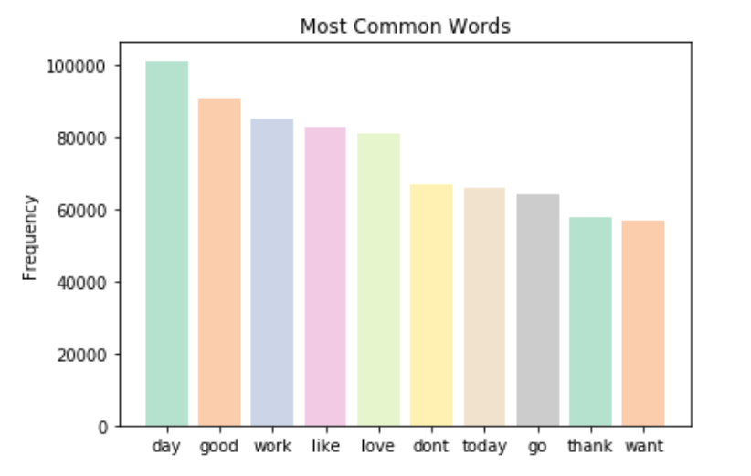
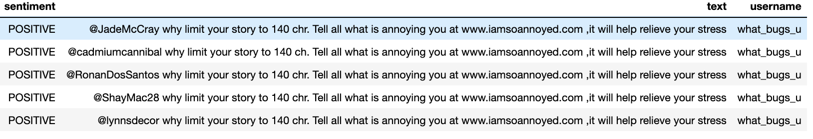
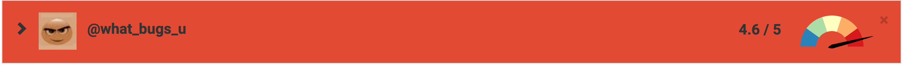
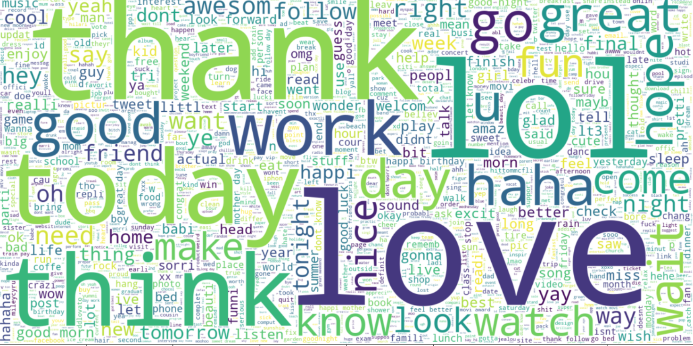
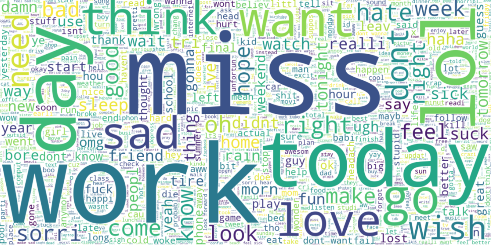
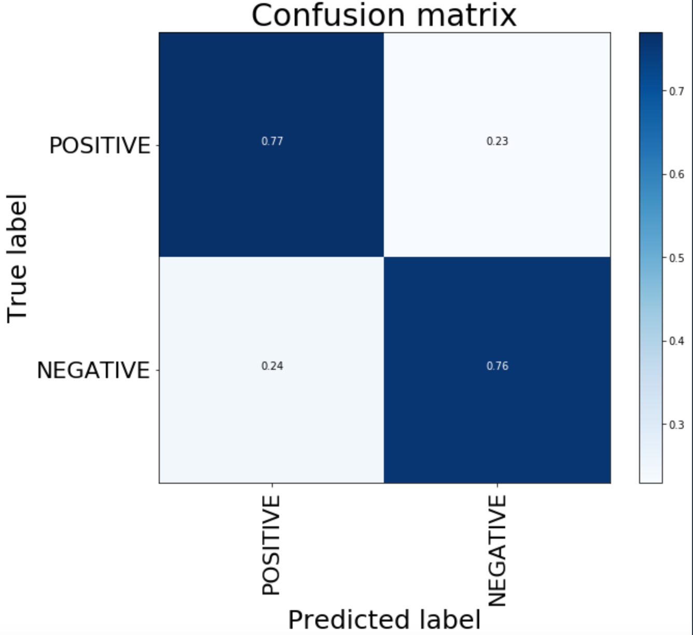

# Twitter-Sentiment-Analysis

## Motivation 
Sentiment analysis is also known as opinion mining and emotion AI. It is a NLP technique that determines whether a text is negative, positive or neutral. There are many avenues(such as Twitter and Facebook) for people to expresss their feelings about a company's products, news events and so on. Sentiment analysis is important to businesses because it can help them measure brand reputation and understand customers feelings about their product. It can also be used to gather wider public opinion around certain topics. My objective is to examine the Twitter Sentiment Analysis dataset and build a model that will predict sentiment on a given tweet with an accuracy of above 70%. 

According to [research](https://en.wikipedia.org/wiki/Sentiment_analysis) "the accuracy of a sentiment analysis system is, in principle, how well it agrees with human judgments. This is usually measured by variant measures based on precision and recall over the two target categories of negative and positive texts. However, according to research human raters typically only agree about 80% of the time. Thus, a program that achieves 70% accuracy in classifying sentiment is doing nearly as well as humans, even though such accuracy may not sound impressive."

## Data

* This data comes from [Twitter](https://www.kaggle.com/kazanova/sentiment140) classified as positive or negative based on emoji. The creators used Twitter API to extract 1.6 Million tweets with emoticons in them. They left the emoticons out in the training set.

* There are 6 columns:
    1. **target**: polarity of tweet
    2. **ids**: tweet id
    3. **date**
    4. **flag**: query flag
    5. **user**: username of person who tweeted
    6. **text**: text of the tweet

    add equal proportions

* Problems with dataset:

    1. **Semantics**: Polarity of the tweet depends on **individual perspective**. Consider "Warriors beat LA :), the 
                      sentiment is positive for Warriors but negative for LA. Improvement could be using a [semantic role labeler](https://cs.stanford.edu/people/alecmgo/papers/TwitterDistantSupervision09.pdf) to indicate which noun is mainly associated with the verb and the classification would take place accordingly.
    2. **Neutral Tweets**: Dataset does not contain neutral tweets
    3. **Emoticon data in test set**: Since emoticons are taken out of training dataset, we can not test for   
                      tweets with emoticons in the test set.

## Data Cleaning

* The following steps were taken for data cleaning:

    In order to feed our text data to a classification model, we first need to tokenize it.
Tokenization is the process of splitting up a single string of text into a list of individual words, or tokens.

Python has a built in string method: string.split(), that splits up any given string into a list based on a splitting character

    1. **Stemming**:  Reduces a word to the base or root word
    2. **Lowercase**: Lowercase the tweets
    3. **Remove**:    Removal of stop words, common words specifically picked looking at dataset(such as tweet),  
                      punctuation, weblinks
    4. **Rename**:    Certain commonly mispelled words
                      

## EDA

* These are the most common top 10 words:

    

  
    * These words seem to represent people's day to day life. People are most often talking about their day. It's  
      interesting to see **thank**, **want** and **miss** in the top 10 list. Further research is needed to see what topics these tweets are associated with.

* These are the most common top 10 usernames:

    

    * What_bugs_you username has the most tweets and looking at the tweets below, we can see that this is most     
      likely a Twitter bot. 

    

    * Botometer is a tool to calculate the likelihood that a Twitter account is a bot. Checking this tool, we can  
      see below that what bugs you is most likely a bot. According to [Wiki](https://en.wikipedia.org/wiki/Twitter_bot), "one significant academic study estimated that up to 15% of Twitter users were automated bot accounts." Removing bot accounts is important in future analysis of the dataset. The classification of positive sentiment doesn't make sense based on the tweet and indicates not only the flaw in using emoticon solely to classify sentiment but also in including the bot account.

    

* Word Clouds:
    produces an image with frequently-appearing words in the text document, where the most frequent words are showcased with bigger font sizes, and less frequent words with smaller font sizes.

    **Positive Word Cloud**:

    

    **Negative Word Cloud:**

    

    * The positive word cloud sentiment shows that love, thank, good, and lol are most often used in positive sentiment tweets. The negative word cloud sentiment shows that miss, work, want, sad, wish, and think are associated with negative sentiment. There is some overlap in the words, such as work and day show up in both clouds. Looking deeper into the tweet, we may find that some people love their job while others dislike working and someone is having a bad day while another person is having a good day.

## Model Predictions

* Multinomial Naïve Bayes uses term frequency. It consideres a feature vector where a given term represents the number of times it appears. MNB assumes that the value of a particular feature is independent of the value of any other feature, given the class variable.

* Using Amazon Sagemaker, the complete dataset was used
* CountVectorizer was used to tokenize the tweets and build a word vocabulary.

* Multinomial Bayes produced the **highest accuracy at 76%**.

    

    
    
* This model achieves 78% precision in finding the positive sentiment. 

* F1 score for positive sentiment is 77% while for negative sentiment it is 76%.

* As discussed earlier, human raters typically only agree about 80% of the time. Accuracy above 70% is doing nearly  
  as well as humans. 

## Conclusion

The applications of sentiment analysis are endless. During the 2012 election, the **Obama administration** used sentiment analysis to gauge public opinion to policy announcements and campaign messages. Companies use social media to look at **customer reviews**, survey responses and competitors. The **finance industry** also uses it in making stock predictions by understanding customers’ sentiment toward certain brands. 

With a **75%** accuracy level we have a good model to make predictions on new tweets. 

Using Flask, I've created a sentiment predictor that can be used for testing new tweets. Nevertheless, this model has various shortcomings.

As the model only evaluates sentences at an independent word level, it performs very poorly when it comes to negations and other multi-words constructs. For example, is the model gets the following input: The concert was good!, it would simply take each individual word (here, and after cleaning the input, \"concert\" and \"good\") and calculate each word's probability to be either positive and negative and finally multiply everything together. Thus, we would expect the model to perform poorly on examples such: The concert was not good! or I'm not very happy :(
    As it never encountered any of these words before, therefore it is unable to properly classify it, and would simply output a random choice.

vectorizer = TfidfVectorizer(ngram_range=(1,2), max_features=500000)  5% of data set for test
## Future Research

    1. Word2Vec was explored and most common words for love were "looov, luv, amaz, ador, stun". I'd like to   
       explore this further. 
    2. Build a model using LTSM
    3. Cleaner dataset: remove Twitter bot accounts 
    4. Find tweets based on specific category 

## Resources

[Twitter Dataset](https://www.kaggle.com/kazanova/sentiment140)

[Twitter Sentiment Classification Using Distant Supervision](https://cs.stanford.edu/people/alecmgo/papers/TwitterDistantSupervision09.pdf)

[Wiki Sentiment Analysis](https://en.wikipedia.org/wiki/Sentiment_analysis)

[Botometer](https://botometer.osome.iu.edu/)

[Sentiment Analysis](https://medium.com/retailmenot-engineering/sentiment-analysis-series-1-15-min-reading-b807db860917)

            