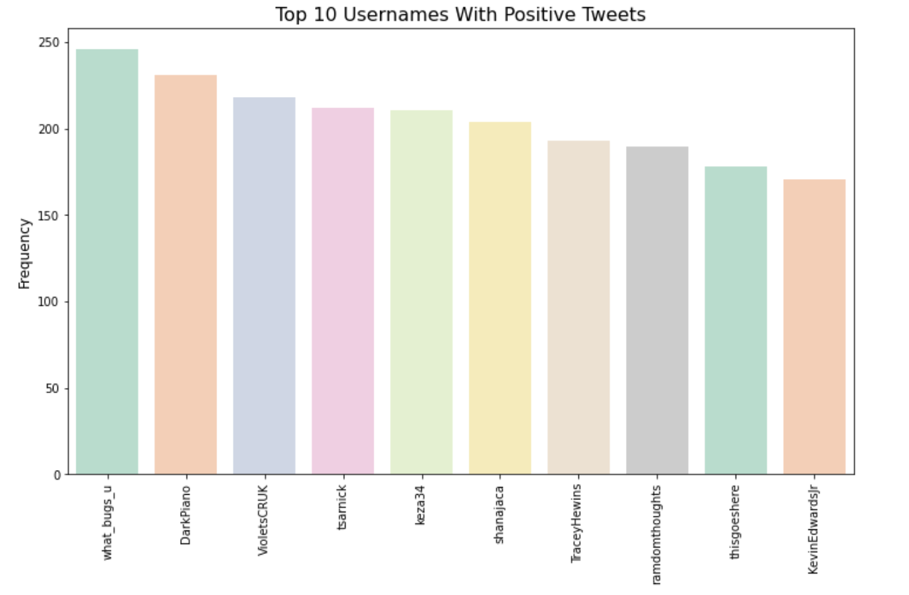

# Twitter-Sentiment-Analysis

## Motivation 
Sentiment analysis is also known as opinion mining and emotion AI. It is a NLP technique that classifies emotions based on text data. There are many avenues(such as Twitter and Facebook) for people to expresss their feelings about a company's products, news events and so on. Sentiment analysis is important to businesses because it can help them measure brand reputation and understand customers feelings about their product. It can also be used to gather wider public opinion around certain topics. My objective is to examine the Twitter Sentiment Analysis dataset and build a model that will predict sentiment on a given tweet with an accuracy of above 70%. 

## Data

* This data comes from [Twitter](https://www.kaggle.com/kazanova/sentiment140) classified as positive or negative based on emoji. The creators used Twitter API to extract 1.6 Million tweets with emoticons in them( this type of training data is abundantly available and can be obtained through automated means). They left the emoticons out in the training set. The dataset is equally divided so that 800,000 tweets are positive and 800,000 tweets are negative. Since the sentiment in the dataset is only classified based on emoticons, any model built using this dataset may have lower than expected accuracy.

* There are 6 columns:
    1. **target**: polarity of tweet
    2. **ids**: tweet id
    3. **date**
    4. **flag**: query flag
    5. **user**: username of person who tweeted
    6. **text**: text of the tweet

* Problems with dataset:

    1. **Semantics**: Polarity of the tweet depends on **individual perspective**. Consider "Warriors beat LA :), the 
                      sentiment is positive for Warriors but negative for LA. Improvement could be using a semantic role labeler, as suggested by [creators of the dataset](https://cs.stanford.edu/people/alecmgo/papers/TwitterDistantSupervision09.pdf) to indicate which noun is mainly associated with the verb and the classification would take place accordingly.
    2. **Neutral Tweets**: Dataset does not contain neutral tweets and in some cases a tweet may be neutral in    
                      sentiment. Thus, there may be tweets in the dataset that are improperly classified.
    3. **Emoticon data in test set**: Since emoticons are taken out of training dataset, we can not test for   
                      tweets with emoticons in the test set.

## Data Cleaning

* The following steps were taken for data cleaning:

    1. **Tokenization**: Tokenization is the process of splitting up a single string of text into a list of  
                         individual words, or tokens. In order to feed our text data to a classification model, we first need to tokenize it. Python has a built in string method(string.split()), that splits up any given string into a list based on a splitting character
    2. **Stemming**:  Reduces a word to the base or root word using PorterStemmer
    3. **Lowercase**: Lowercase the tweets
    4. **Remove**:    Removal of English stop words, common words specifically picked looking at dataset(such as  
                      tweet), punctuation, weblinks
    5. **Rename**:    Rename a few commonly mispelled words
                      

## EDA

* These are the most common top 10 usernames:

    

    * What_bugs_you username has the most tweets and looking at the tweets below, we can see that this is most    
      likely a Twitter bot. 

    

    * Botometer is a tool to calculate the likelihood that a Twitter account is a bot. Checking this tool, we can  
      see below that what bugs you is most likely a bot. According to [Wiki](https://en.wikipedia.org/wiki/Twitter_bot), "one significant academic study estimated that up to 15% of Twitter users were automated bot accounts." Removing bot accounts is important in future analysis of the dataset. The classification of positive sentiment in the above example is not accurate based on the tweet and signifies the flaw not only in using emoticon solely to classify sentiment, but also in including the bot account.

    

* Word Clouds:

    Word Clouds produce an image with frequently-appearing words. The most frequent words are showcased with bigger font sizes and less frequent words with smaller font sizes.

    **Positive Word Cloud**:

    

    **Negative Word Cloud:**

    

    * The positive and negative word clouds show the words that are most often used in positive and negative sentiment tweets. There is some overlap in the words, such as work, today, think and lol show up in both clouds. Looking deeper into the tweets, we may find that some people love their job while others dislike working and someone is having a bad day while another person is having a good day. 

## Model Predictions

**Overview**

According to [research](https://en.wikipedia.org/wiki/Sentiment_analysis) "the accuracy of a sentiment analysis system is, in principle, how well it agrees with human judgments. This is usually measured by variant measures based on precision and recall over the two target categories of negative and positive texts. However, according to research human raters typically only agree about 80% of the time. Thus, a program that achieves 70% accuracy in classifying sentiment is doing nearly as well as humans, even though such accuracy may not sound impressive." Our goal is to achieve an accuracy close to 80%.

Using AWS Sagemaker, Multinomial Baive Bayes and Logistic Regression models were implemented on the full dataset. Test size was 5% of the dataset.

**Feature Weighting**
* Using TF-IDF, weights are assigned to words. Words unique to a particular document have higher weight than 
  common words used across documents.
* TF-IDF means Term Frequency — Inverse Document Frequency
* TD-IDF is a statistic which defines how important a word is for a document
* If a word appears in a document, TD-IDF is increased but if it appears in other docuements, TD-IDF value  
  decreases.
* Using N_gram range  = 1,2 and max_features = 500,000 provided the greatest accuracy

**Model Selection**

**Multinomial Naïve Bayes** 
* Consideres a feature vector where a given term represents the number of times it appears
* MNB assumes that the value of a particular feature is independent of the value of any other feature
* Multinomial Bayes produces an **accuracy of 78% on testing data**. Train accuracy was 82%.

* This model achieves 77% precision in finding the positive sentiment. 
* F1 score for positive sentiment is 79% while for negative sentiment it is 76%.

**Logistic Regression**
* Logistic Regression uses a cost function called Sigmoid function(between 0 and 1)
* Sigmoid function maps predicted values to a value between 0 and 1
* Logistic regression assumes that the dependent variable is categorical in nature and the independent 
  variable should not have multi-collinearity.
* LR produces an **accuracy of 79% on testing data**. Train accuracy was 83%.

* This model achieves 78% precision in finding the positive sentiment. 
* F1 score for positive sentiment is 80% while for negative sentiment it is 77%.

* As discussed earlier, human raters typically only agree about 80% of the time. Accuracy above 70% is doing nearly  
  as well as humans. 

**Logistic Regression** is the chosen model due to slightly higher accuracy and precision scores.

## Conclusion

The applications of sentiment analysis are endless. During the 2012 election, the **Obama administration** used sentiment analysis to gauge public opinion to policy announcements and campaign messages. Companies use social media to look at **customer reviews**, survey responses and competitors. The **finance industry** also uses it in making stock predictions by understanding customers’ sentiment toward certain brands. 

With a **79%** accuracy level we have a good model to make predictions on new tweets. 

Using Flask, I've created a sentiment predictor that can be used for testing new tweets. This model predicts "love" as positive with 99.2% probability. The model handles negations properly with "Today is a good day" having positive sentiment with 96% probability and "Today is not a good day" having negative sentiment with 96% probability. The model does not handle emojis properly because these were taken out of the training data by the creators of the data set. If the predictor has not encountered a word before, it will be less accurate with properly classifying it and would output a random sentiment.

## Future Research

    1. Word2Vec was explored and most common words for love were "looov, luv, amaz, ador, stun". I'd like to   
       explore this further. 
    2. Build a model using LTSM
    3. Cleaner dataset: remove Twitter bot accounts 
    4. Find tweets based on specific category 

## Resources

[Twitter Dataset](https://www.kaggle.com/kazanova/sentiment140)

[Twitter Sentiment Classification Using Distant Supervision](https://cs.stanford.edu/people/alecmgo/papers/TwitterDistantSupervision09.pdf)

[Wiki Sentiment Analysis](https://en.wikipedia.org/wiki/Sentiment_analysis)

[Botometer](https://botometer.osome.iu.edu/)

[TF-IDF Explained](https://towardsdatascience.com/tf-idf-explained-and-python-sklearn-implementation-b020c5e83275)

[Sentiment Analysis](https://medium.com/retailmenot-engineering/sentiment-analysis-series-1-15-min-reading-b807db860917)

            